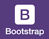

# Rainbow Dash
Serving Bootstrap through Handlebars with Require (via ExpressJS)

A minimal stack that renders a "living template" of Bootstrap GUI widgets (components) using the HandlebarsJS template system. All thanks to RequireJS.

## Description

I wanted to find a way to load Bootstrap templates using Handlebars, ideally doing so with RequireJS. These solutions all seemed to incorporate Backbone or some other off-the-shelf MVC/P framework. I wanted to do all that, but without using a third-party MVC framework.

It took a few hours, but I was finally able to implement that formula using a [RequireJS Handlebars plugin](https://github.com/jfparadis/requirejs-handlebars) authored by [Jean-Francois Paradis](http://www.jeanfrancoisparadis.com/).

## Setup

### Preparation

Clone this project into a new directory.
```
mkdir rd
cd rd
git clone https://github.com/quantumtom/rainbow-dash
```

Update npm 
```javascript 
npm update -g npm
```

### Installation

Run the package installer.
```javascript
npm install
```

## Use
Run the ExpressJS server.
```javascript
node server.js
```
Visit the site at http://localhost:5000/index.html

## Dependencies

### 
[RequireJS](http://www.requirejs.org) is my loader of choice. Dependency management -- say no more, right? 
Enforces code modularity in a file-based tree hierarchy.
v. [2.1.8is](http://jrburke.com/2013/07/08/requirejs-2.1.8-released/) included in this project's JavaScript library.

### 
[jQuery](http://www.jquery.org) is the modern foundation of an extensive family of plug-ins, libraries, and extensions. It's a hard depdendency for Bootstrap. Loading it with RequireJS can be a bit tricky.

### 
Twitter [Bootstrap](http://getbootstrap.com) is a fantastic UI library that integrates nicely with jQuery.

### 
Based on the Mustache standard, [Handlebars](http://handlebarsjs.com/) is the modern JavaScript template system of choice. Works well in both client and server capacities.

## Extras

### 
The [Grunt](http://www.gruntjs.org) task runner is an indespensible tool for test and building from source files.

### 
We're testing out an older configuration for [JSHint](http://jshint.com/). See the .jshintrc for more info.

### AMD MVC ("AM123")
*AM123*: A _working title_ for the modular micro MVC ("3MVC") single-page app ("SPA").

## Credits

I configured Bootstrap to load widgets using CSS themes from [Bootswatch](http://www.bootswatch.com).

I implemented an MVC pattern based on the tutorial created by [Jonathan Verrecchia](http://verekia.com/requirejs/build-simple-client-side-mvc-app-require-js/).


_Rainbow Dash Cutie Mark_ by [ErisGrim](http://erisgrim.deviantart.com/) on [Deviant](http://www.deviantart.com/morelikethis/312568678)

## Recent Updates

2016-02-16 - Rename project due to popular demand.

2016-02-16 - Update dependencies and logos.

2016-02-16 - Fix Grunt task for JSHint.

2016-02-16 - Update documentation.
